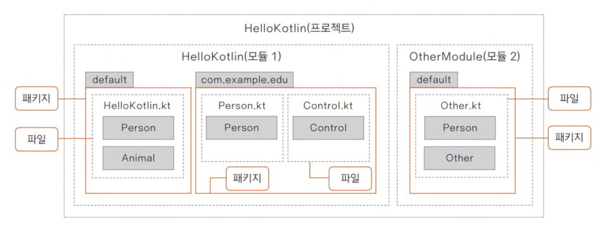
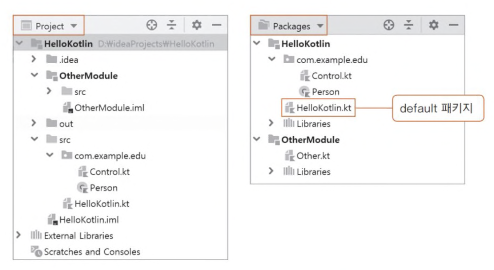
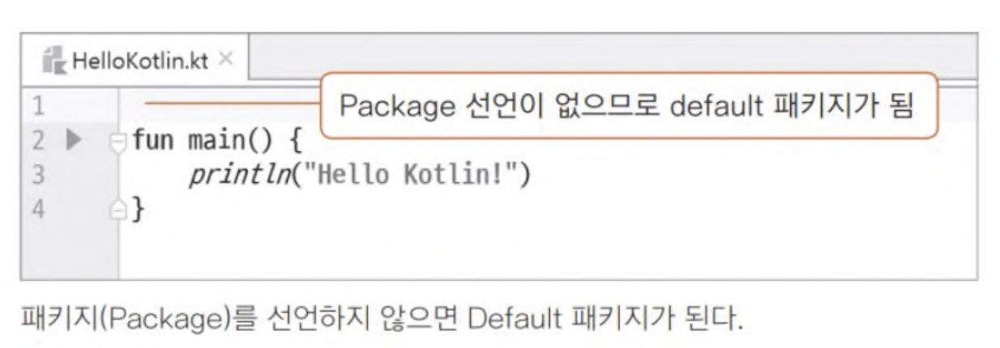
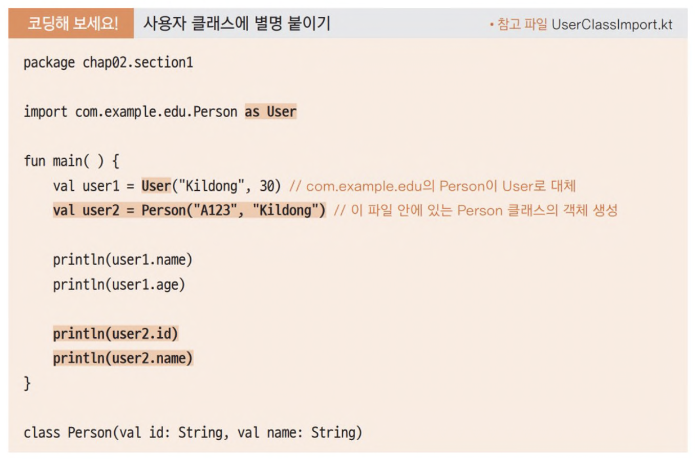

**코틀린 프로젝트, 모듈, 패키지, 파일의 관계 이해하기**

코틀린 프로젝트에는 모듈이 있고 모듈은 다시 패키지로 구성되어 있다. 그리고 패키지는 파일(클래스)로 구성되어 있다.

보통 대규모 프로젝트를 진행할 때는 기능을 모듈로 분리하여 관리한다.
   

Intellij IDE 좌측 사이드바에서 보면 src폴더 안에 default 패키지가 보이지 않는다. src폴더에 따로 패키지 이름이 지정되지 않은 파일이 default 패키지에 포함된다. 위의 그림에서 HelloKotlin.kt파일은 default 패키지에 포함된 것이다.
   

패키지 이름을 선언하지 않으면 그 파일은 자동으로 default 패키지에 포함된다. (파일이 패키지 폴더 안에 들어 있어도 패키지 이름을 선언하지 않으면 default 패키지에 포함된 것으로 인식)
 
 
 

**패키지를 만들어야 하는 이유**

만약 2명의 프로그래머가 프로젝트를 진행하다 우연히 같은 이름의 파일(클래스)을 만들었다고 가정해보자. 당연히 오류가 발생해야 하자미나 패키지가 다르면 오류가 발생하지 않는다.
 
 

**기본 패키지 활용하기**

기본 패키지란 코틀린으로 프로그램을 만들 때 자주 사용한느 클래스와 함수 등을 미리 만들어 놓은 것. 보통, 패키지는 import 키워드로 선언해야 사용할 수 있지만, 코틀린에서 제공하는 기본 패키지는 import 키워드로 패키지를 선언하지 않아도 바로 사용할 수 있다. 예를 들어, String 자료형으로 변수를 선언하면 코틀린은 기본 패키지 안에서 String 클래스를 찾아 변수를 선언해준다.
 
 

**사용자 클래스 가져오기**
직접 만든 사용자 클래스를 다른 패키지에서 사용하려면 패키지의 이름과 함께 패키지의 요소를 import 키워드와 함께 적으면 된다. 아래 그림은 com.example.edu 패키지에 포함된 Person 클래스를 chap02.section1 패키지의 UserClassImport.kt에 가져온 것.

하지만 이곳에 같은 이름의 클래스(Person)이 있는 경우에는 as라는 키워드를 이용해 클래스 이름에 별명을 붙여 사용하면 충돌을 피할 수 있다.

 
 
 
 
 
 
[참고 : Do it! 코틀린 프로그래밍](http://www.yes24.com/Product/Goods/74035266)